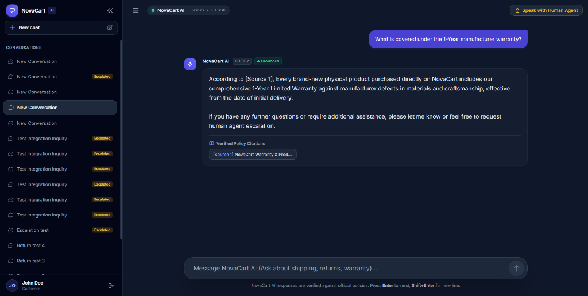
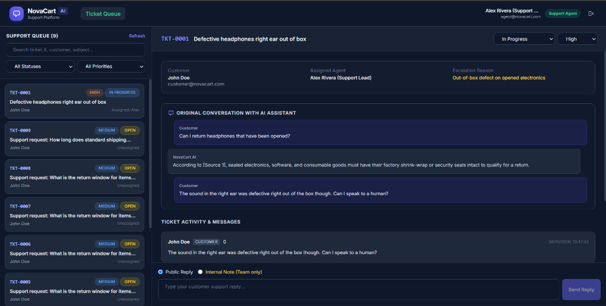

# NovaCart AI — Customer Support Platform

> **An end-to-end, production-grade AI customer support system** built with local RAG (Retrieval-Augmented Generation), strict anti-hallucination guardrails, human agent escalation, multi-role ticket management, and an admin observability dashboard — **zero paid AI APIs required**.

---

## Screenshots

### Customer Chat — AI Assistant


### Support Agent Dashboard — Ticket Queue


---

## Table of Contents

- [Features](#-features)
- [Tech Stack](#-tech-stack)
- [Project Structure](#-project-structure)
- [Quick Start](#-quick-start)
- [Demo Accounts](#-demo-accounts)
- [How It Works — RAG Pipeline](#-how-it-works--rag-pipeline)
- [Human Escalation Workflow](#-human-escalation-workflow)
- [API Reference](#-api-reference)
- [Running Tests](#-running-tests)
- [License](#-license)

---

## Features

| Feature | Description |
|---|---|
| **AI Chat (RAG)** | Answers customer questions grounded in your knowledge base with cited sources |
| **Anti-Hallucination** | Refuses to speculate — if confidence is too low, it says so and offers to escalate |
| **Ticket Escalation** | One-click escalation from AI chat to a structured human support ticket |
| **Agent Queue** | Support agents see a filterable ticket queue with priority, status, and assignment |
| **Internal Notes** | Agents can write private notes visible only to the support team |
| **Admin Dashboard** | Live KPI metrics, knowledge base management, RAG query logs |
| **Role-Based Auth** | Three roles: `CUSTOMER`, `SUPPORT_AGENT`, `ADMIN` — each with their own UI |
| **Fully Local AI** | Uses Ollama locally — no OpenAI, no Anthropic, no API bills |

---

## Tech Stack

### Backend
- **Runtime**: Node.js 22 (ES Modules)
- **Framework**: Express 4
- **Database**: SQLite via `@libsql/client` (WAL mode, foreign keys enabled)
- **Auth**: JWT + bcrypt (12 rounds)
- **Validation**: Zod
- **Logging**: Winston (structured JSON logs)
- **Security**: Helmet, express-rate-limit

### AI & Vector Search
- **LLM**: Ollama — `qwen3:4b` model (runs locally)
- **Embeddings**: Ollama — `nomic-embed-text` (768-dim vectors)
- **Vector Store**: ChromaDB — with automatic offline cosine-similarity fallback
- **RAG Strategy**: Paragraph-aware semantic chunking with configurable overlap

### Frontend
- **Framework**: React 18 + Vite 5
- **Styling**: Tailwind CSS 3
- **Routing**: React Router 6
- **Data Fetching**: TanStack Query + Axios

### Testing
- **Framework**: Jest 29 + Supertest 7
- **Coverage**: 20 unit and integration tests

---

## Project Structure

```
AI-chatbot/
├── client/                  # React frontend (Vite)
│   └── src/
│       ├── pages/           # LoginPage, ChatPage, AgentPage, AdminPage
│       ├── components/      # Reusable UI components
│       └── App.jsx
├── server/                  # Express backend
│   ├── src/
│   │   ├── routes/          # Auth, conversations, tickets, agent, admin, knowledge
│   │   ├── services/        # RAG pipeline, vector store, LLM client
│   │   └── app.js           # Entry point
│   ├── knowledge-base/      # Source documents (.txt, .md, .pdf, .json)
│   └── tests/               # Jest test suites
├── docs/                    # Screenshots and documentation assets
├── scripts/                 # Seed scripts
├── .env.example             # Environment variable template
└── package.json             # Root scripts (dev, seed, test)
```

---

## Quick Start

### Prerequisites

- **Node.js 22+** — [nodejs.org](https://nodejs.org)
- **Ollama** (optional, for real AI responses) — [ollama.com](https://ollama.com)
  - Pull models: `ollama pull qwen3:4b && ollama pull nomic-embed-text`
  - Without Ollama, the app runs with a built-in offline fallback — still fully functional for testing.

---

### Step 1 — Clone & Install

```bash
git clone https://github.com/your-username/AI-chatbot.git
cd AI-chatbot

# Install all dependencies (root + server + client)
npm install
cd server && npm install
cd ../client && npm install
cd ..
```

### Step 2 — Configure Environment

```bash
# Copy the example env file
cp .env.example .env
```

The default `.env` works out of the box for local development. Open it if you want to change ports or Ollama settings.

### Step 3 — Seed the Database

This loads sample policy documents (shipping, returns, warranty, FAQs) and creates default demo accounts:

```bash
npm run seed
```

### Step 4 — Start the Development Servers

```bash
npm run dev
```

This starts:
- **Backend API** → `http://localhost:5000`
- **Frontend UI** → `http://localhost:5173`

Open [http://localhost:5173](http://localhost:5173) in your browser.

---

## Demo Accounts

The login page includes a **one-click role switcher** so you can jump between roles instantly.

| Role | Email | Password | What You'll See |
|---|---|---|---|
| **Customer** | `customer@novacart.com` | `CustomerPass123!` | AI chat interface with escalation button |
| **Support Agent** | `agent@novacart.com` | `AgentPass123!` | Ticket queue, replies, internal notes |
| **Admin** | `admin@novacart.com` | `AdminPass123!` | Metrics dashboard, knowledge base, RAG logs |

---

## How It Works — RAG Pipeline

Every customer message goes through this pipeline before a response is generated:

```
Customer Message
      │
      ▼
1. Query Classifier
   (detects intent & topic category)
      │
      ▼
2. Vector Embedding
   (Ollama nomic-embed-text  OR  offline 768-dim fallback)
      │
      ▼
3. Vector Retrieval
   (ChromaDB cosine similarity — top-K chunks from knowledge base)
      │
      ▼
4. Confidence Evaluation
   ├─ Score >= 0.70  →  SUPPORTED        → Grounded answer with [Source N] citations
   ├─ Score 0.60-0.70 → PARTIALLY_SUPPORTED → Answer + escalation suggestion
   └─ Score < 0.60  →  UNSUPPORTED      → Politely refuses + offers to create a ticket
      │
      ▼
5. RAG Observability Log
   (every query stored in rag_logs for admin review)
```

**Key design principle:** The LLM is never allowed to answer from training data alone. If the knowledge base doesn't support an answer, it says so.

---

## Human Escalation Workflow

1. **Customer** chats with the AI and clicks **"Speak with Human Agent"**.
2. A support ticket (`TKT-XXXX`) is created, including:
   - The full AI conversation history
   - The exact retrieved document chunks that triggered the escalation
3. **Support Agent** sees the ticket in their queue (filterable by status, priority, assignment).
4. Agent can:
   - Reply publicly (customer sees it)
   - Write an **internal note** (team-only, never shown to the customer)
   - Update ticket status (`OPEN` → `IN_PROGRESS` → `RESOLVED`)
   - Change priority (`LOW`, `MEDIUM`, `HIGH`)
5. Customer receives agent replies in their ticket view.

---

## API Reference

### Authentication
| Method | Path | Description |
|---|---|---|
| `POST` | `/api/auth/register` | Create a new customer account |
| `POST` | `/api/auth/login` | Sign in and receive a JWT token |
| `GET` | `/api/auth/me` | Get current user's profile |

### Conversations & AI Chat
| Method | Path | Description |
|---|---|---|
| `GET` | `/api/conversations` | List all conversations for current user |
| `POST` | `/api/conversations` | Start a new conversation |
| `GET` | `/api/conversations/:id` | Get full message history |
| `POST` | `/api/conversations/:id/messages` | Send a message (triggers RAG pipeline) |
| `POST` | `/api/conversations/:id/escalate` | Escalate to a human support ticket |

### Tickets (Customer)
| Method | Path | Description |
|---|---|---|
| `GET` | `/api/tickets` | List current customer's tickets |
| `POST` | `/api/tickets` | Create a new ticket manually |
| `GET` | `/api/tickets/:id` | Get ticket details and thread |
| `POST` | `/api/tickets/:id/messages` | Reply to a ticket |

### Agent Queue (Agent / Admin)
| Method | Path | Description |
|---|---|---|
| `GET` | `/api/agent/tickets` | View all tickets with filters |
| `PATCH` | `/api/agent/tickets/:id` | Update status, priority, or assigned agent |
| `POST` | `/api/agent/tickets/:id/messages` | Send public reply or internal note |

### Knowledge Base (Admin)
| Method | Path | Description |
|---|---|---|
| `GET` | `/api/knowledge/documents` | List all ingested documents |
| `POST` | `/api/knowledge/documents` | Upload a new document (.txt, .md, .pdf, .json) |
| `POST` | `/api/knowledge/documents/:id/reindex` | Re-chunk and re-embed a document |
| `DELETE` | `/api/knowledge/documents/:id` | Remove document and its vectors |

### Admin & Observability (Admin)
| Method | Path | Description |
|---|---|---|
| `GET` | `/api/admin/stats` | Live KPI metrics and RAG performance stats |
| `GET` | `/api/admin/users` | View all users and roles |
| `PATCH` | `/api/admin/users/:id` | Change a user's role or active status |
| `GET` | `/api/admin/rag-logs` | Full RAG query observability log |

---

## Running Tests

```bash
npm test
```

The test suite covers:
- Text extraction and document cleaning
- Semantic chunking with overlap
- Confidence evaluator thresholding logic
- Anti-hallucination prompt construction
- End-to-end API integration (auth flow, conversations, RAG citations, ticket escalation)

---

## License

MIT License — see [LICENSE](LICENSE) for details.
